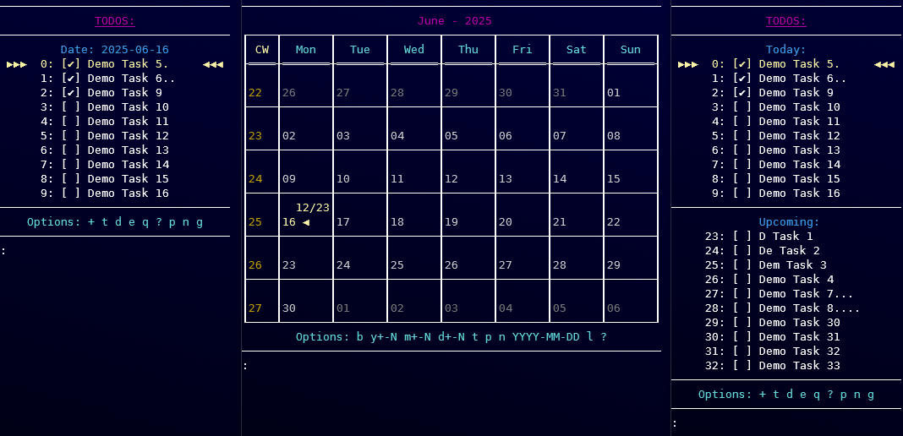

# ToDo Application



A simple command-line ToDo application to manage your tasks efficiently.

## Features
- Add, edit, and toggle tasks.
- Save and load tasks from a file.
- CLI options for ASCII UI, demo tasks, and disabling colors.

## Installation
1. Clone the repository:
   ```bash
   git clone https://github.com/derDere/todos.md
   ```
2. Install dependencies:
   ```bash
   pip install -r requirements.txt
   ```
3. Run the application:
   ```bash
   python main.py
   ```

## Usage
Run the application with the following options:
- `-h, --help`: Show help message.
- `-a, --ascii`: Use ASCII character set for the UI.
- `-d, --demo`: Add demo tasks to the ToDo list.
- `-nc, --no-colors`: Disable colored output.
- `filename`: Specify the file to load/save the ToDo list (default: `~/todo.yaml`).

Example:
```bash
python main.py --ascii --demo my-todos.yaml
```

## License
This project is licensed under the [GNU GPLv3 License](LICENSE).
